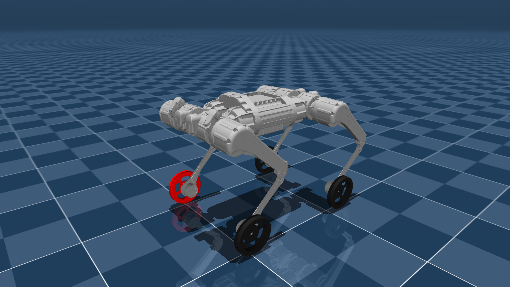

# MAB Robotics HB50W Description (MJCF)

> [!IMPORTANT]
> Requires MuJoCo 2.3.7 or later.

## Changelog

See [CHANGELOG.md](./CHANGELOG.md) for a full history of changes.

## Overview

This package contains a robot description (MJCF) of the HB50W, a wheeled variant of the [HB50](https://www.mabrobotics.pl/honey-badger-5) quadruped developed by [MAB Robotics](https://www.mabrobotics.pl/). It derives from the MJCF in [robot_models](https://github.com/mabrobotics/robot_models).

  

## Derivation steps

1. Removed additional scenes, leaving just the basic one.
2. Copied the meshes into `assets/`.
3. Set `meshdir="assets"` in `<compiler>` and removed previous prefix from the mesh files.

## License

This model is released under an [Apache-2.0 License](LICENSE).
